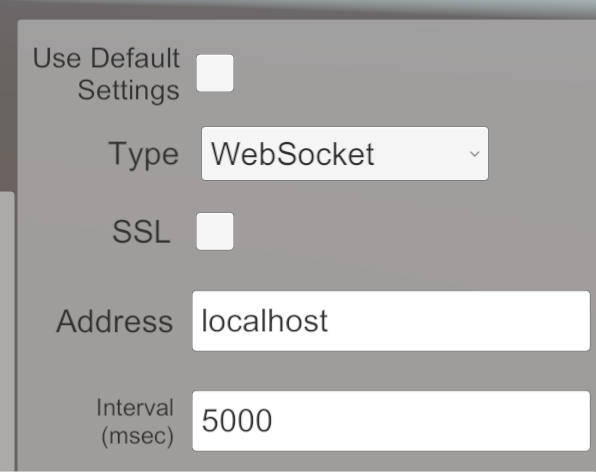

# Samples

The package contains the following samples.

| Scene | Details |
| ----- | ------- |
| [Receiver](sample-receiver.md) | Displaying a video streaming from another Unity |
| [Broadcast](sample-broadcast.md) | Streaming video and audio to multi Unity applications |
| [Bidirectional](sample-bidirectional.md) | bi-directional(send/receive) each other's video |
| [Multiplay](sample-multiplay.md) | Multi player game using video streaming |
| [RenderPipeline](sample-renderpipeline.md) | Streaming video using HDRP or URP |
| [AR Foundation](sample-arfoundation.md) | Controling a camera using AR Foundation |
| [Gyroscope](sample-gyroscope.md) | Controling a camera using Gyroscope |
| [Web Browser Input](sample-browserinput.md) | Streaming the video from Unity to the web browser |

## Import samples in project
You can import samples from the bottom of the `com.unity.renderstreaming` package in the **Package Manager** Window.

## Build Settings

It is easy to try all samples if only you put sample scenes into `Scenes in Build` in **Build Settings** Window. **Menu** scene should be loaded as a first one so you need to rearrange scenes.

## Sample menu

**Menu** scene is helpful for checking multiple sample scenes. You can find the scene `Example/Menu/Menu.scene`.

Open **Menu** scene and press `Play` button, as you can see the menu for sample scenes.

You can change signaling settings below during runtime.

| Parameter | Description |
| --- | --- |
| **Use Default Settings** | Refer to settings of [Project Settings](settings.md). |
| [**Signaling Type**](signaling-type.md) | *Http* or *WebSocket*. |
| **Enable/Disable SSL** | Use **https** if set enable. |
| **Host Address** | Set IP address or URL of your signaling server. |
| **Interval (msec)** | Polling interval for communication of signaling.   This parameter effects Http signaling. |

Moreover, you can choice the options about the video streaming settings.

| Parameter | Description |
| --- | ---|
| **Video Codec (Receiver)** | Choice preferred video codec for receiver.   Often the performance of [Hardware codec](https://docs.unity3d.com/Packages/com.unity.webrtc@2.4/manual/videostreaming.html#hardware-acceleration-codecs) is greater than software codec. |
| **Video Codec (Sender)** | Choice preferred video codec for sender. |
| **Stream Size** | Set the resolution of video streaming for sender. |
