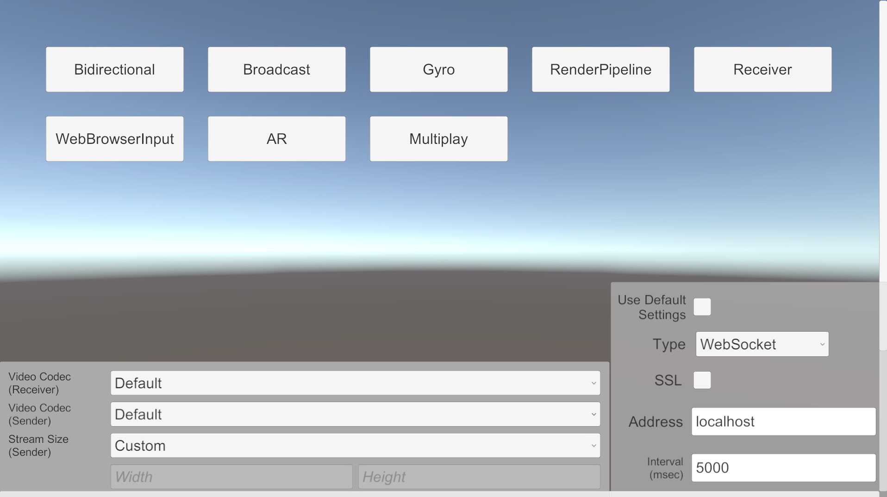

# Samples

The package contains the following samples. 

| Scene | Details |
| ----- | ------- |
| [Receiver](sample-receiver.md) | Displaying a video streaming from another Unity |
| [Broadcast](sample-broadcast.md) | Streaming video and audio to multi Unity applications |
| [Bidirectional](sample-bidirectional.md) | bi-directional(send/receive) each other's video |
| [RenderPipeline](sample-renderpipeline.md) | Streaming video using HDRP or URP |
| [AR Foundation](sample-arfoundation.md) | Controling a camera using AR Foundation. |
| [Gyroscope](sample-gyroscope.md) | Controling a camera using Gyroscope. |
| [Web Browser Input](sample-browserinput.md) | Streaming the video from Unity to the web browser |

## Import samples in project
You can import Samples from the bottom of the `com.unity.renderstreaming` package in the PackageManager Window.

## Sample menu

`Menu` scene is helpful for checking multiple sample scenes. You can find the scene `Example/Menu/Menu.scene`.

Open `Menu` scene and press `Play` button, as you can see the menu for sample scenes.

## Install samples into mobile devices 

It is easy to try all samples on mobile devices if only you put sample scenes into `Scenes in Build` in Build Settings Window. `Menu` scene should be loaded as a first one so you need to rearrange scenes.

