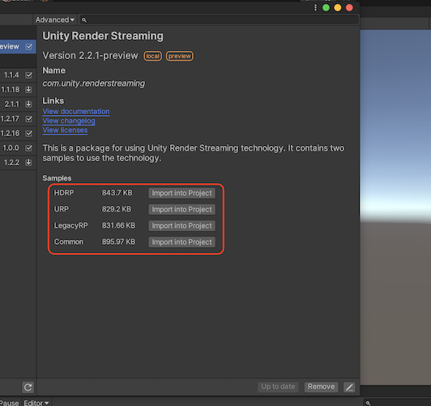

# Samples

## About Samples

* [Receiver](sample-receiver.md)
* [Broadcast](sample-broadcast.md)
* [Bidirectional](sample-bidirectional.md)
* [RenderPipeline](sample-renderpipeline.md)
* [AR Foundation](sample-arfoundation.md)
* [Gyroscope](sample-gyroscope.md)
* [Web Browser Input](sample-browserinput.md)

## Import Samples
You can import Samples from the bottom of the `com.unity.renderstreaming` package in the PackageManager Window.

