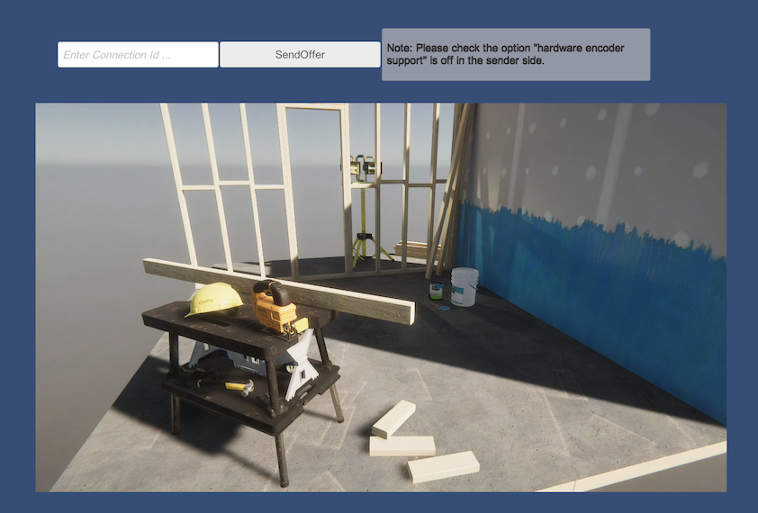

# Import Samples
You can import Samples from the bottom of the `com.unity.renderstreaming` package in the PackageManager Window.

# About Samples

## HDRP / URP / LagacyRP Sample

This is a sample of Render streaming in various render pipelines. 
`SimpleRenderStreamingXXXX` Scene is a sample scene to send the camera image.
To receive the video, refer to the page of [WebApplication](webapp.md).
`RenderPipeline/XXXX/Scripts/XXXXRenderTextureBilter` is a component for displaying the rendering result of a specific camera in GameView.
It can be used to display the video to be sent in GameView.

## Common Sample
The samples included in this can be used independently of rendering pipeline.

### ReceiveVideo Scene

This is a sample for receiving VideoTrack of MediaStream. 
Click `SendOfferButton` to create a new `PeerConnection` and send the Offer to server.
You can also use any `ConnectionId`. In that case, enter the `ConnectionId` in the `InputField`.
This scene uses `ReceiveVideoViewer` component to receive a VideoTrack of MediaStream.
Please see [Components settings](components.md) page for details.

> [!NOTE]
> In version 2.2, the only video codec that can be received is VP8/VP9. If errors occur, check the video codec settings on the sending side.

### 1on1 Sample Scene

This is a sample of bidirectional video send/receive.
This sample is intended for use in [WebApplication](webapp.md) in Private mode. (It does not work in Public mode.)
Please add the `-m private` argument on starting the Web Application.
Enter the same `ConnectionId` as the person you want to communicate with in `Input Field`.
Click `SetUp` to create a new` PeerConnection` corresponding to the entered `ConnectionId` and connects to the server.
If other side is already connected, Offer will be sent automatically.
Click `HangUp` to end the current communication.