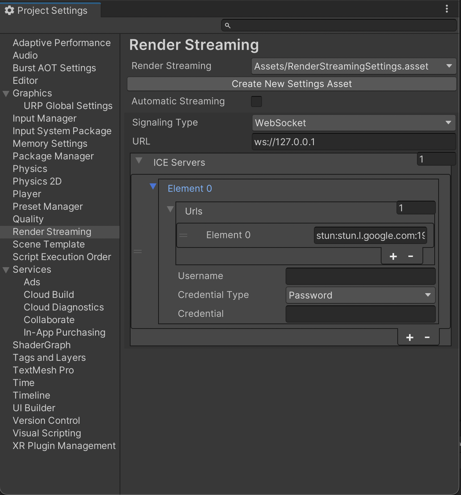

# Render Streaming Settings

Unity Render Streaming saves configuration assets to the project. The configuration asset are created in the Render Streaming panel of the Project Settings Window. If your project contains more than one configuration asset, select the asset in the Render Streaming Settings section.

## General Settings

| Parameter | Description | Default |
| ---- | ---- | ---- |
| **Automatic Streaming** | Automatically performs the necessary setup for streaming and starts streaming. | Enabled |

### Behaviour of the Automatic Streaming flag

If the **Automatic Streaming** flag is turned on, the application will automatically set up for streaming when it's started. This initialization process takes place before calling the **MonoBehaviour.Start** method on the scene. When streaming starts, the screen on the game view and the audio played by the **AudioListener** are delivered. It also receives mouse and keyboard input from the client and is configured to work with the Input System.

Streaming continues even when moving between scenes. If you want to stop streaming, turn the **Automatic Streaming** flag off.

## Signaling Settings

| Parameter | Description | Default |
| ---- | ---- | ---- |
| **Signaling Type** | Choose the signaling type (See [About Signaling Type](signaling-type.md)). | websocket |
| **Signaling Server URL** | Set the signaling server URL.  If you use WebSocket as a signaling protocol, you should specify a URL starting with **ws** or **wss**. | ws://127.0.0.1 |
| **ICE Server** | Set a list of STUN/TURN servers. (See [TURN Server](turnserver.md)) | |
| **URLs** | Set URLs of STUN/TURN servers. | [stun:stun.l.google.com:19302\] |
| **Username** | The username to use when logging into the TURN server. | |
| **Credencial** | The credential to use when logging into the TURN server. | |
| **Credencial Type** | This attribute specifies what kind of **credential** is to be used when connecting to the TURN server. | Password |
| **Polling Interval** | Set the polling frequency (in milliseconds) to the signaling server  Valid only if you are using Http as the signaling protocol. | 5000 (msec) |
