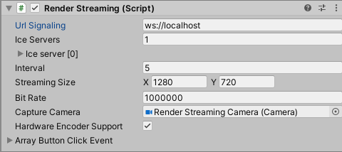

# About Signaling Type

**The Unity Render Streaming** package provides three different signaling types as examples.

- `Http Signaling`
- `WebSocket Signaling`

In the example, the schema given to `URL Signaling` is used to determine which type to use.



If it starts with `http`, `Http Signaling` is used. If it starts with `ws`, `WebSocket Signaling` is used.

```
# launch server for WebSocket
webserver.exe

# launch server for HTTP
webserver.exe -t http
```

## `Http Signaling`

Signaling is handled by HTTP Request.
The signalling server is polled at specified intervals to obtain the Offer and Candidate of the difference from the last time.

## `WebSocket Signaling`

Signaling is handled by WebSocket.
When the signaling server receives the Offer or Candidate, the server distributes it to the connected clients.
> [!WARNING]
> WebSocket does not work in iOS Safari on servers that use self-signed certificates.
> If you want to verify the behavior of WebSocket signaling in iOS Safari, use a certificate issued by a trusted certification authority. Or try signaling with HTTP.
