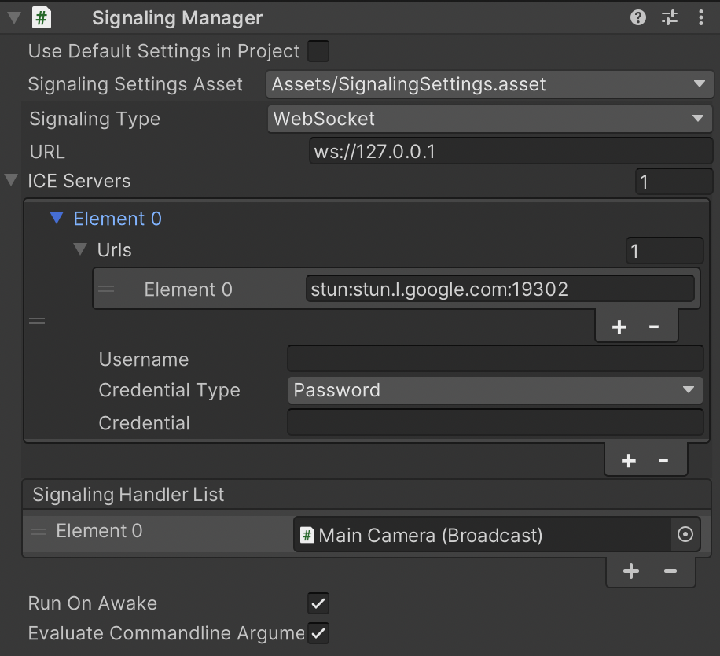
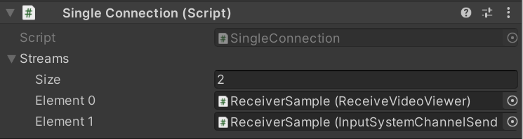
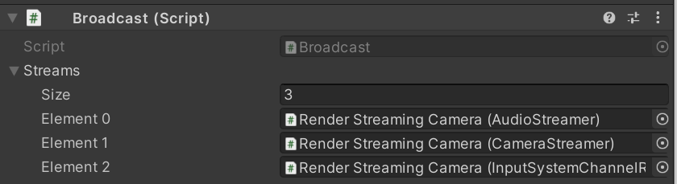

# Streaming Management Component

Unity Render Streaming automatically creates and destroys streams as needed. It also allows the developer to customize the mechanism for controlling the stream. For a description of components related to individual streams, see the section on components for streaming.

## [`SignalingManager`](../api/Unity.RenderStreaming.SignalingManager.html) component reference

**SignalingManager** includes the following features.

- Communication with signaling servers
- Streaming input from cameras
- Associating browser input with events

### Properties

| Parameter | Description | Default |
| ---- | ---- | ---- |
| **Use Default Settings in Project Settings** | Use settings in [Project Settings Window](settings.md). | Enabled |
| **Signaling Settings Asset** | Choose the signaling settings. | |
| **Signaling Type** | Choose the signaling type (See [About Signaling Type](signaling-type.md)). | websocket |
| **URL** | Set the signaling server URL.  If you use WebSocket as a signaling protocol, you should specify a URL starting with **ws** or **wss**. | ws://127.0.0.1 |
| **Ice Servers** | Set a list of STUN/TURN servers. (See [TURN Server](turnserver.md)) | |
| *Urls* | Set URLs of STUN/TURN servers. | `[stun:stun.l.google.com:19302\]` |
| *Username* | The username to use when logging into the TURN server. | |
| *Credencial* | The credential to use when logging into the TURN server. | |
| *Credencial Type* | This attribute specifies what kind of **credential** is to be used when connecting to the TURN server. | **Password** |
| **Polling Interval** | Set the polling frequency (in milliseconds) to the signaling server  Valid only if you are using Http as the signaling protocol. | 5000 (msec) |
| **Run On Awake** | Automatically started when called `Awake` method. | Enabled |
| **Evaluate Command Line Arguments** | Evaluate [command line arguments](commandline-option.md). | Enabled |
| **Signlaing Handler List** | List of handlers of signaling process. | |

## [`SingleConnection`](../api/Unity.RenderStreaming.SingleConnection.html) component reference

This component lists components that stream media or data via a single peer connection.

### Properties

| Parameter | Description | Default |
| --------- | ----------- | ------- |
| **Streams** | List of streams | [] |

## [`Broadcast`](../api/Unity.RenderStreaming.SingleConnection.html) component reference

This component lists components that stream media or data via multiple peer connections.

### Properties

| Parameter | Description | Default |
| --------- | ----------- | ------- |
| **Streams** | List of streams | [] |
