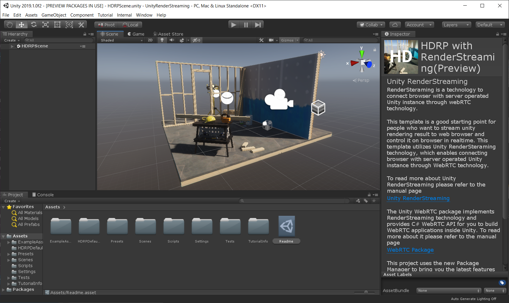

# Project Template

This document describes the way to start using the template package of Unity Render Streaming.

### Download the Package

Download the template package from [Github Release](https://github.com/Unity-Technologies/com.unity.webrtc/releases). Please download the package below.

- `com.unity.template.renderstreaming-x.x.x-preview.tgz`


> [!NOTE]
> This process made for temporary use. It is not needed if these packages are registered to PackageManager in the future.

### Install the package

Put the package in a dedicated folder in order to use them as a project template.
The project template can be selected as a template when creating a new Unity project. 


When using the template package, put the tgz file in the following folders. 
Move `com.unity.template.renderstreaming-x.x.x-preview.tgz` to this folder

```
 <Unity Editor Root>/Data/Resources/PackageManager/ProjectTemplates
```

After moving the packages, open the Unity Hub and create a new project. Confirm that `Render Streaming` has been added as a template. 

### Launch the Web application

To launch web application, Select an item **Edit / Render Streaming / Download web app** from the menu bar. 


Be shown the command prompt when execute the file. Confirm that the following log displays in the command prompt. The web server's address should be displayed. Details on web  server command options can be found on the [Web server](webserver.md) page.


The web server's source code is located in the `WebApp` folder. Additionally, [Node.js](https://nodejs.org) must be installed in order to run the source code. Download the installer from the website.

### Unity Settings

Open the `Assets/Scenes/samplescene.unity` sample scene.



Select `RenderStreaming` in the Hierarchy. Check the `Render Streaming` components in the Inspector. 


Set the address of the web server you just activated under the `URL Signaling` parameter. For details on the various settings in the Inspector. 

### Accessing the Web Page

Launch one of the [supported browsers](../index.md) from the list. 
Access the Web server's address. The following web page will be displayed. 


If this doesn't happen, it's possible that the browser version is too old. Be sure to install the latest version. 