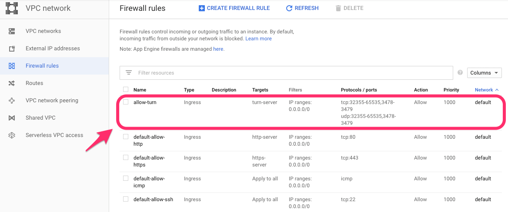
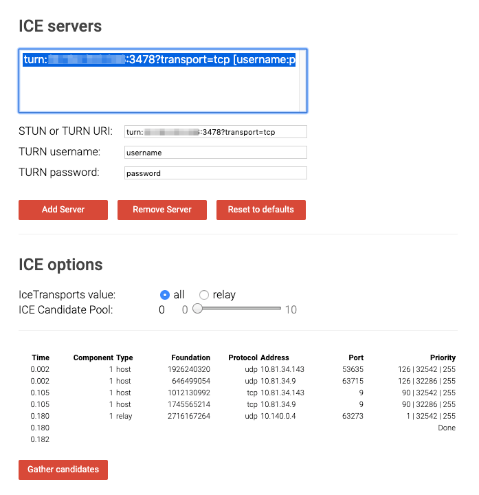
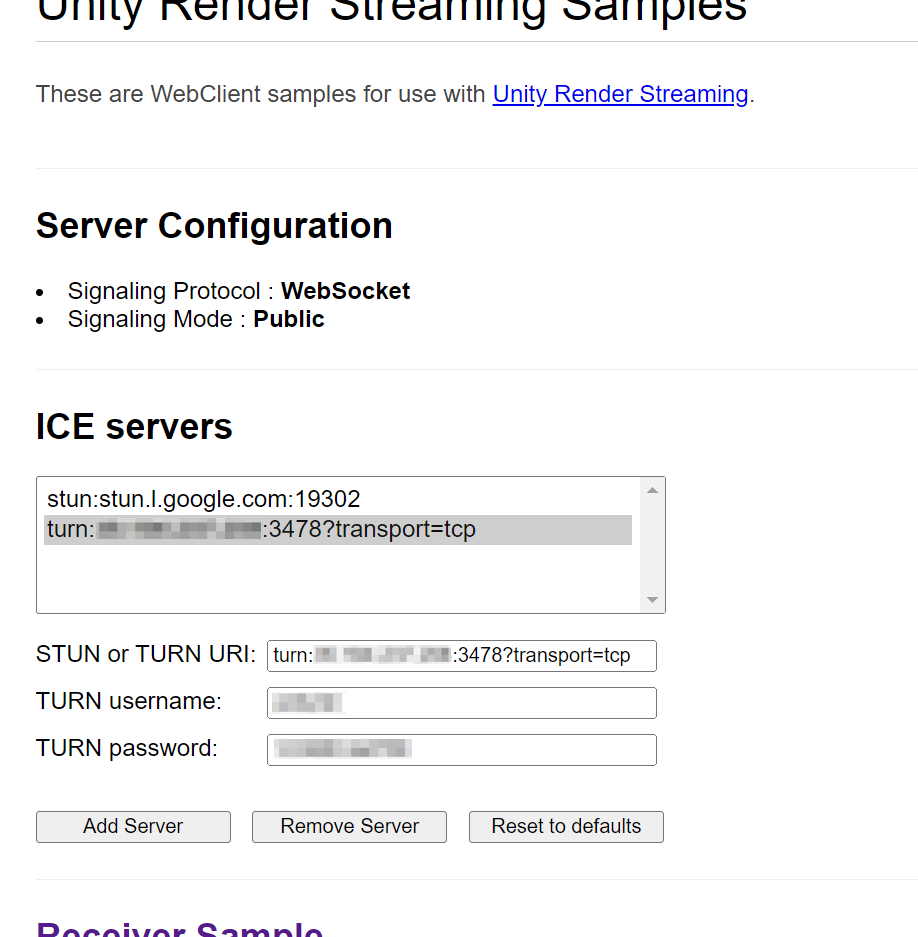
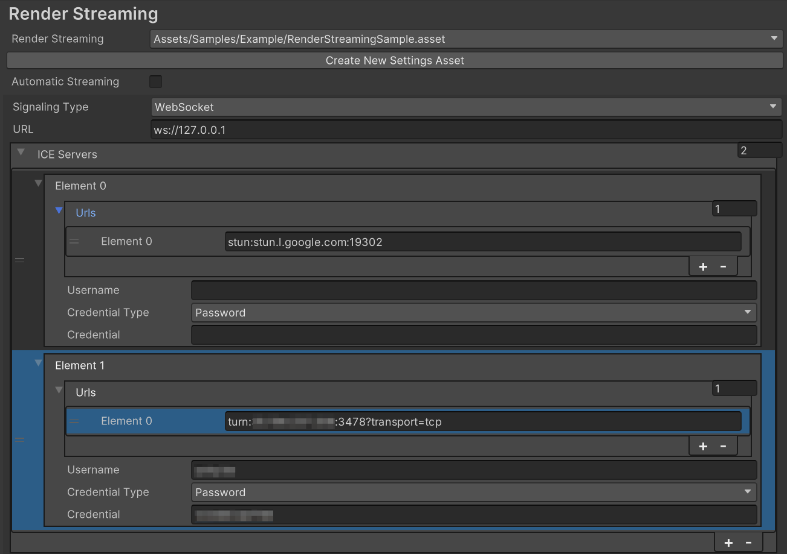

# Setting for TURN Servers

If streaming is not functioning correctly in Unity Render Streaming, consult the [troubleshooting guide](faq.md).
If you are experiencing firewall issues, you may need to change your firewall settings or use a **TURN server**.

**TURN（Traversal Using Relay around NAT）** is a communication protocol for transmitting across NAT and firewalls. A **TURN server** must be set up on the outside of the NAT in order to use TURN.

This document covers the process of linking Unity Render Streaming to a TURN server.

## Instance settings

[coturn](https://github.com/coturn/coturn) software is an open source implementation for TURN servers.
The following is an explanation for running coturn on a GCP instance.

**ubuntu-minimal-1604-xenial-v20190628** is used in the instance image so that the `apt` command can be used to install coturn. If the distribution is supported by coturn, there shouldn't be any issues. See the [coturn documentation](https://github.com/coturn/coturn) for details on coturn.

### Firewall rules settings

The port used by the TURN server needs to be public, so add the following settings to the firewall.

| Protocol | PORT                   |
| -------- | ---------------------- |
| TCP      | 32355-65535, 3478-3479 |
| UDP      | 32355-65535, 3478-3479 |



### Installing coturn

Log into the GCP instance with `ssh`.
Install `coturn`.

```shell
sudo apt install coturn
```

Change the settings for booting with a daemon to use coturn as a TURN server.
Edit the following file.

```shell
sudo vim /etc/default/coturn
```

Add the following line.

```
TURNSERVER_ENABLED=1
```

Next, edit the coturn settings file.

```shell
sudo vim /etc/turnserver.conf
```

Remove the comments from the following lines, and add any necessary information.

```shell
# The TURN server IP address to be sent to external peers
external-ip=10.140.0.4

# Validate credentials
lt-cred-mech

# Designate username and password
user=username:password

# Realm settings
realm=yourcompany.com

# Log file settings
log-file=/var/tmp/turn.log
```

When finished, restart the coturn service.

```shell
sudo systemctl restart coturn
```

### Connection verification

After completing the coturn settings, check the log to verify that the TURN server is function correctly.

```
tail -f /var/tmp/turn_xxxx-xx-xx.log
```

Use the [webrtc sample](https://webrtc.github.io/samples/src/content/peerconnection/trickle-ice/) to connect to the TURN server. Use the following settings and click `Add Server`.

| Parameter        | Example                               |
| ---------------- | ------------------------------------- |
| STUN or TURN URI | `turn:xx.xx.xx.xx:3478?transport=tcp` |
| TURN username    | username                              |
| TURN password    | password                              |



Click `Gather candidates` to show a list of potential communication paths. Verify that a log is also printed on the TURN server side.

### Browser side changes

Start the web server, access the site, and add the TURN server settings to each of the ICE servers as follows:



### Unity side changes

Open the Project Settings window and add the URL of the TURN server to the Render Streaming settings as shown below.


