# Tutorial 

In this page, we introduce the way to use samples published on Package Manager.

## Install package

> [!NOTE]
> In Unity `2020.2` and `2019.4`, there are differences about how to install Unity Render Streaming package so please pay attention to the Unity version you are using and follow the instructions below.

### Case of Unity 2019.4

Select `Window/Package Manager` in the menu bar.

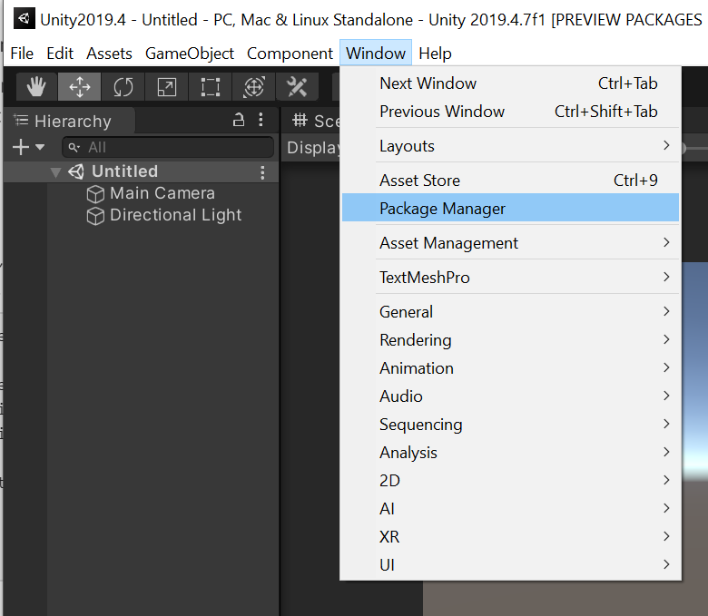

Check Package Manager window, Click `Advanced` button and enable `Show preview packages`.

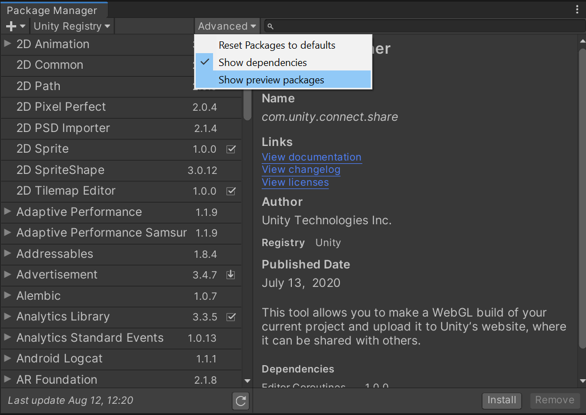

Input `renderstreaming` to the search box at the top of the Package Manager window.

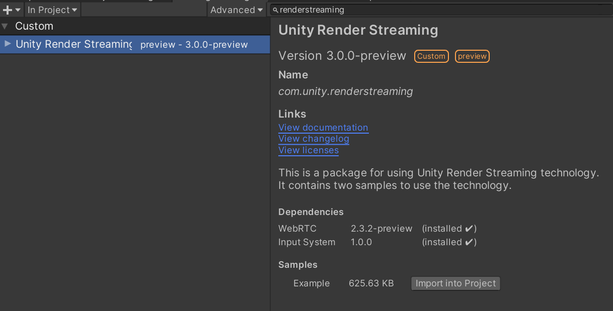

Click `Install` button at the bottom left of the window, and will start install the package.

If an input system dialog box appears, click `Yes`

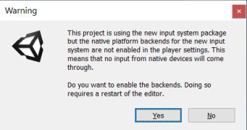

### Case of Unity 2020.2

Select `Window/Package Manager` in the menu bar.

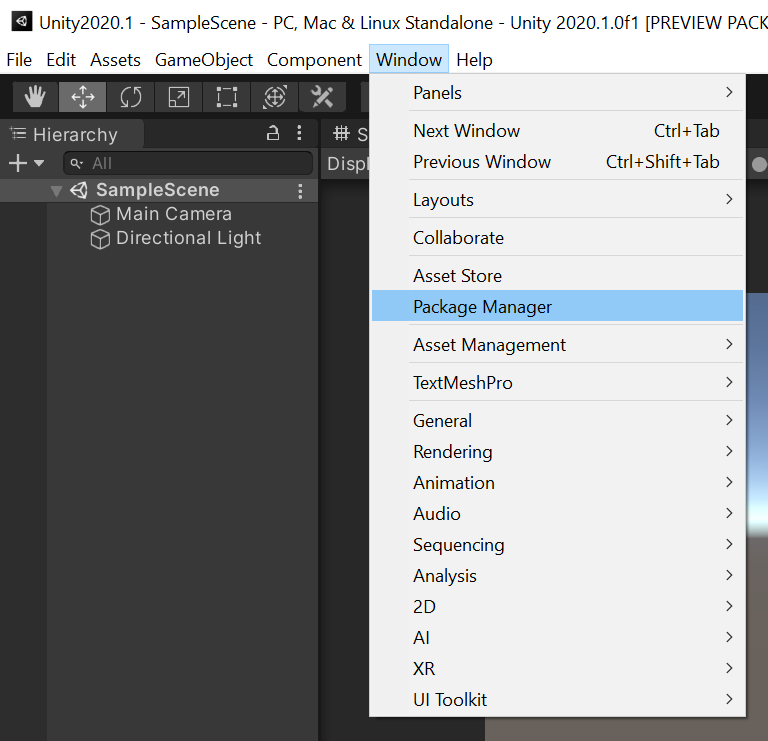

Check Package Manager window, Click `+` button and select `Add package from git URL...`.

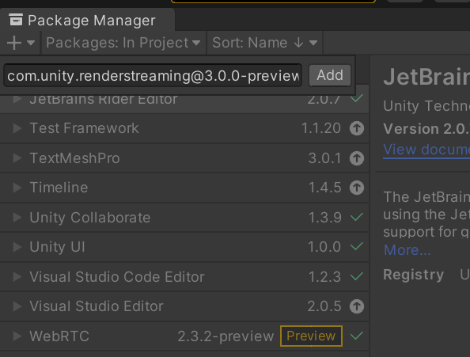

Input the string below to the input field.

```
com.unity.renderstreaming@3.0.1-preview
```

The list of version string is [here](https://github.com/Unity-Technologies/com.unity.renderstreaming/tags). In most cases, the latest version is recommended to use.

 Click `Add` button, and will start install the package.

If an input system dialog box appears, click `Yes`


## Install web application

Click on `Edit/Render Streaming/Download web app` menu item to download the application from [this page](https://github.com/Unity-Technologies/UnityRenderStreaming/releases).


When the select download folder window appears, click on `Select Folder` to download the file to the default folder


After the download is finished and a `powershell` or `cmd` window is opened, and run `webserver.exe` with `-w` option. Please refer to [this page](webapp.md) for commandline options.

```
.\webserver.exe -w
```

You can see logs on the commandline like below.


## Install samples

You can import Samples from the bottom of the `com.unity.renderstreaming` package in the PackageManager Window.

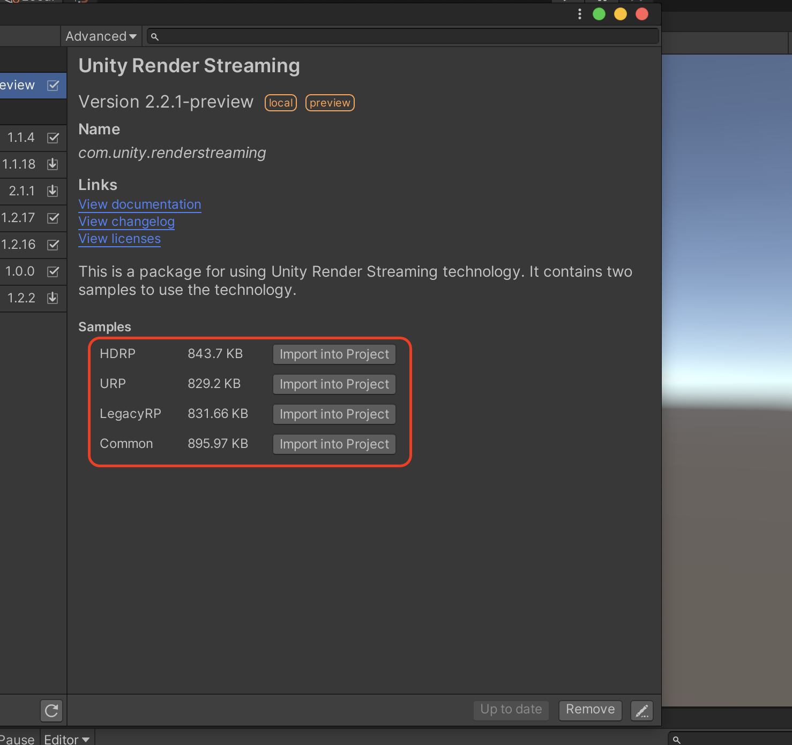

## Play Unity

Open `WebBrowserInput` scene.

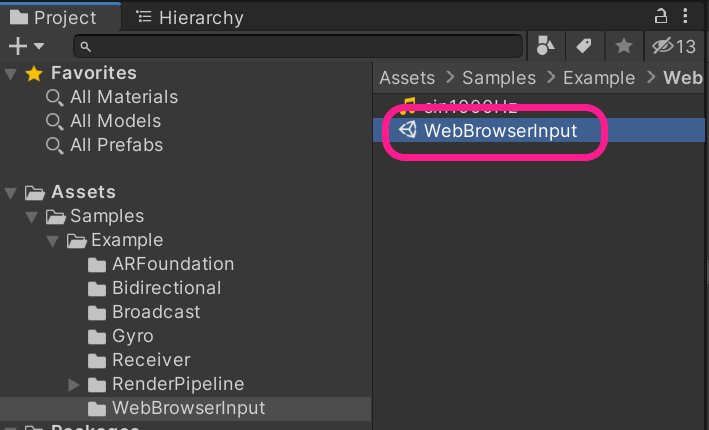

Enter play mode in Unity Editor.

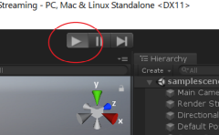

Open your web browser and access `http://localhost`. You can see the top page. Click a `VideoPlayer Sample` link.

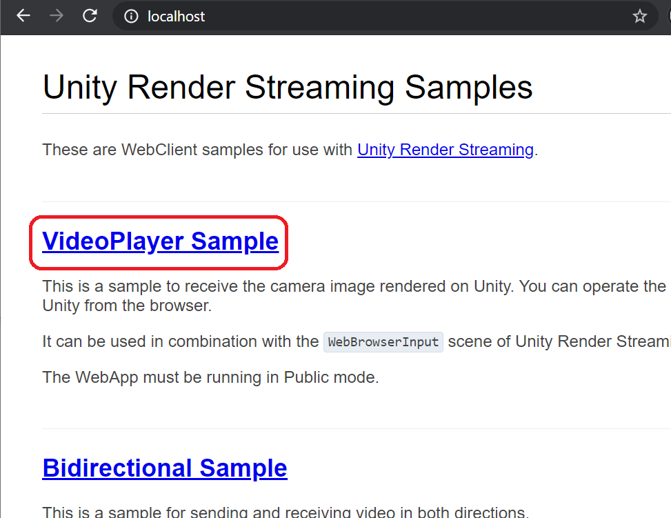

You can see the Unity scene on the browser, and control a camera in the Unity scene.

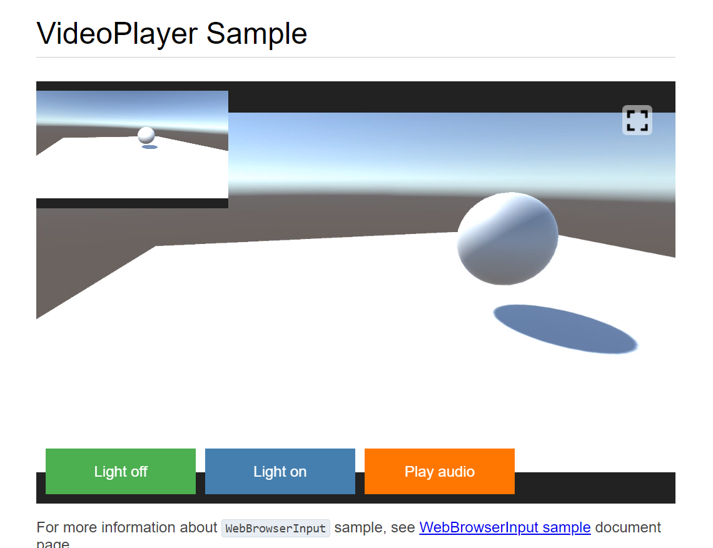

## Deploy to Furioos

As you may already know, **Unity Render Streaming** has a Furioos-compatible signaling option. This means that you can build a dedicated version of your application, host it on **Furioos**, and share it with thousands of customers who will enjoy all the features of **Unity Render Streaming**. But you will **not** have to deal with any of the difficulties of setting up a private server, a machine in the cloud or manage the scalability of your solution.

To do so, the requirement is to select "FurioosSignaling" in the "Signaling server type" parameter of the [RenderStreaming](components.md#render-streaming) component.
This allow your application to connect to Furioos services when running on the managed virtual machines.

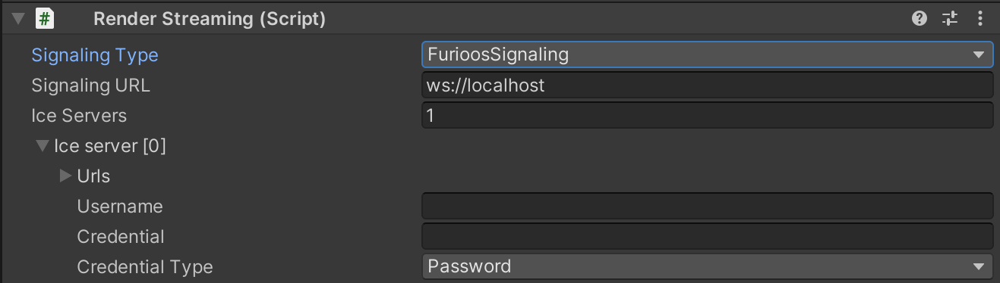

Then just build a **standalone Windows version** of your application, and zip it! Don't try to build iOS, Android, linux or whatever version of your app, **Furioos only support Windows applications**. Also, be sure to zip the whole exported folder with all files and sub-folders, not just the ".exe" file.

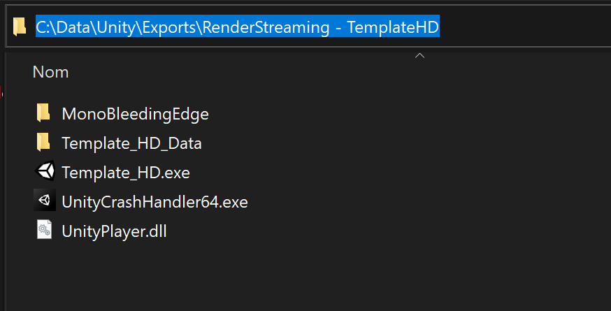

Finally just upload it on your account at https://portal.furioos.com/ .
If you need futher help to upload your application on **Furioos**, please follow [this tutorial](https://support.furioos.com/article/adding-an-application-on-furioos/).

You can check the stream type on https://portal.furioos.com/ by clicking to the "more options" button in the toolbar.

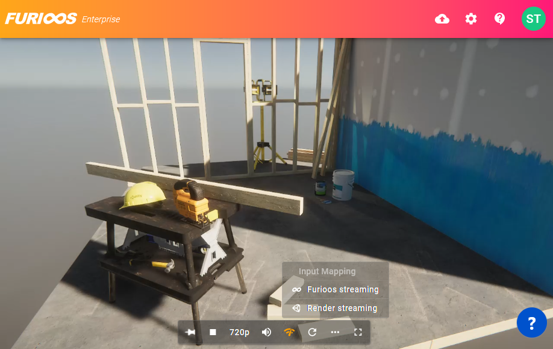

## After tutorial

About general questions, please see [FAQ](faq.md) page. And you are available for discussions about Unity Render Streaming on [Unity Forum](https://forum.unity.com/forums/unity-render-streaming.413). 

About the operation of inspectors, please see [Components settings](components.md) page. 
About options of web application, please see [The web application](webapp.md) page.
You can see more details for samples on the [Samples](samples.md) page.