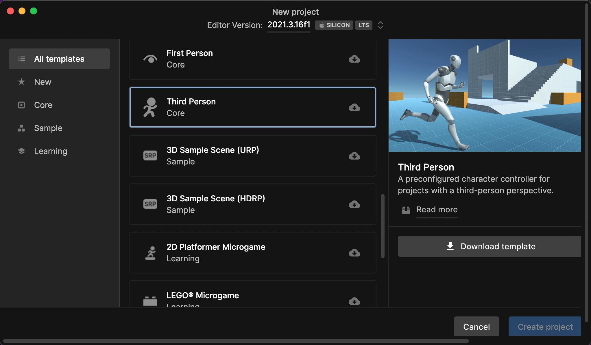

# Tutorial

This page describes how to create a scene that uses Unity Render Streaming, and introduces you to key features that help you produce the 3D contents works on browsers via streaming.

## Before you begin

- Please read the [Requirements](index.md#requirements) to understand the limitation.
- This tutorial uses **localhost** and port **80** for the signaling server. Please read [Signaling Settings](settings.md#signaling-settings) page if you want to change the address and port number.

## Creating a Unity project from the Template

1: Open the Unity Hub.

2: Go to **Projects**, and select **New Project**.


3: Open the **Core** tab and select **Third Person**.



4: Enter a **Project name**.

5: Select **Create Project**.

Unity creates a project, and after Unity opens the Template Project, you can see the **Playground** scene.


This template is designed to work on many platforms, so it is an good starting point for projects aiming for streaming. If you want to achieve a high-end graphics, we recommend using the HDRP sample templates.

## Unity Render Streaming setup

1: Select **Window > Package Manager** in the menu bar.


2: Check Package Manager window, Click **+** button and select **Add package by name**. If you use Unity 2020.3, select **Add package from git URL**.


3: Input the string below to the input field.

```
com.unity.renderstreaming
```

4: The **Render Streaming Wizard** window is opened automatically after installing the package. Select **Fix All**.


5: Select **Play** on Unity Editor.

## Launch web app

1: Select **Download latest version web app** on the Render Streaming Wizard window.


2: Launch the app.

It is succeeded if you can see logs in the console like below.


## Connect from browser

1: Launch the browser. <br/> Please see the supported browsers list in the [Requirements](index.md) page.

2: Go to **http://127.0.0.1** on the browser.

3: Select **Receiver Sample**.


4: Select **Play**.

You can see the game view on the browser, and the mouse and keyboard input effects the game view.


## Connect from mobile browser

1: This project contains virtual gamepad. Please select **UI_Canvas_StarterAssetsInputs_Joysticks** in Hierarchy window, and set active.

You can see the gamepad in Game View.


2: When connecting from a mobile browser, the SSL certificate must be enabled on the signaling server. Please see [this page](https.md).

3: Start the signaling server using the created certificate. Please see the options of web server [here](webapp.md)

4: Set the new **URL** of the web server to Signaling Settings in Project Settings window.

5: Select **Play** on the Unity Editor.

6: Access the web page from the mobile browser.

You don't mind it if you see the warning page like below.


7: Select **Receiver Sample**.

You can see the game view on the mobile browser.

## Next Step

This tutorial explained an example using the Unity Project created from a template, and manipulating the character in 3D game from web browsers. An another example, developers can do the same by setting up some components on the scene. Please see [this page](dev-streaming-app-intro.md). This method allows for more detailed customization.
