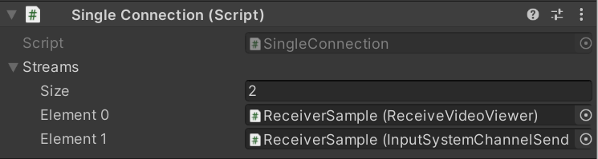

# Using with Input System

Unity Render Streaming supports controlling device input using [Input System](https://docs.unity3d.com/Packages/com.unity.inputsystem@latest). Input from a browser or Unity can be reflected to Unity on another PC.

The user input on the browser is converted to the Input System message format and sent messages to another PC. The receiver can support both Unity and the browser without having to implement any additional functionality.

The package provides the following components for integration with the Input System.

## `SimplePlayerInput` component

This component is a simplification of the Input System's [`PlayerInput`](https://docs.unity3d.com/Packages/com.unity.inputsystem@1.1/manual/Components.html#playerinput-component) without the [Control Schemes](https://docs.unity3d.com/Packages/com.unity.inputsystem@1.1/manual/ActionBindings.html#control-schemes). Although `PlayerInput` is superior in most cases, it is useful when there is a need to manually control the addition and removal of individual input devices without using the features of Control Schemes. You can use [Input Actions](https://docs.unity3d.com/Packages/com.unity.inputsystem@1.1/manual/Actions.html) to edit the connection between input from a device and its behavior without having to code it.

You can pair any input devices using `SimplePlayerInput`.

### Properties

| Parameter | Description | Default |
| --------- | ----------- | ------- |
| **Actions** | The set of [Input Actions](https://docs.unity3d.com/Packages/com.unity.inputsystem@1.0/manual/Actions.html) associated with the player. | None |
| **Default Action Map** | Which [Action Map](https://docs.unity3d.com/Packages/com.unity.inputsystem@1.0/manual/Actions.html#overview) in Actions to enable by default. | None |
| **Events** | Uses a separate [`UnityEvent`](https://docs.unity3d.com/ScriptReference/Events.UnityEvent.html) for each individual type of message. | Empty |

## `RemotePlayerInput` component

This component is an extension class for `SimplePlayerInput`. It pairs devices automatically by assigning `InputReceiver` from the inspector.

### Properties

| Parameter | Description | Default |
| --------- | ----------- | ------- |
| **Actions** | The set of [Input Actions](https://docs.unity3d.com/Packages/com.unity.inputsystem@1.0/manual/Actions.html) associated with the player. | None |
| **Default Action Map** | Which [Action Map](https://docs.unity3d.com/Packages/com.unity.inputsystem@1.0/manual/Actions.html#overview) in Actions to enable by default. | None |
| **Events** | Uses a separate [`UnityEvent`](https://docs.unity3d.com/ScriptReference/Events.UnityEvent.html) for each individual type of message. | Empty |