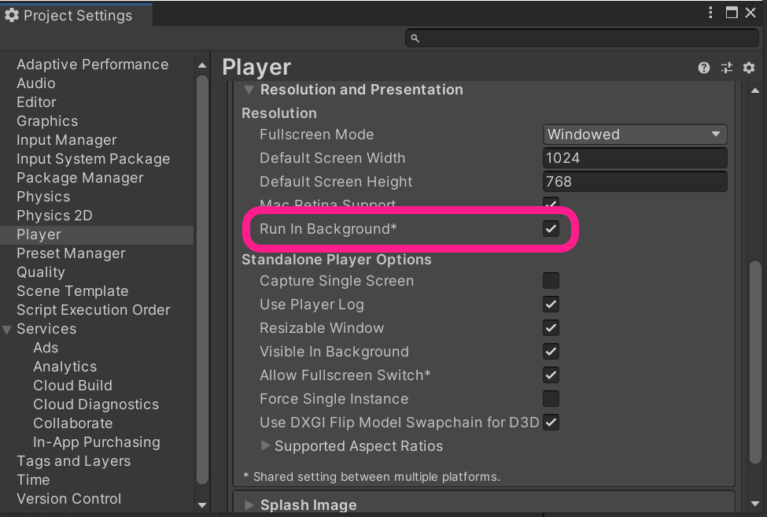
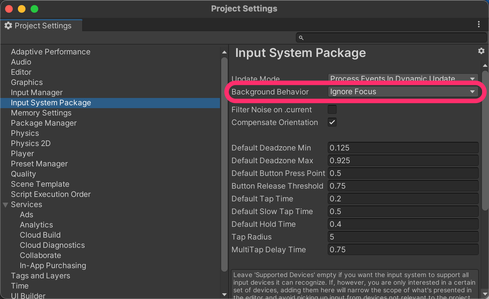
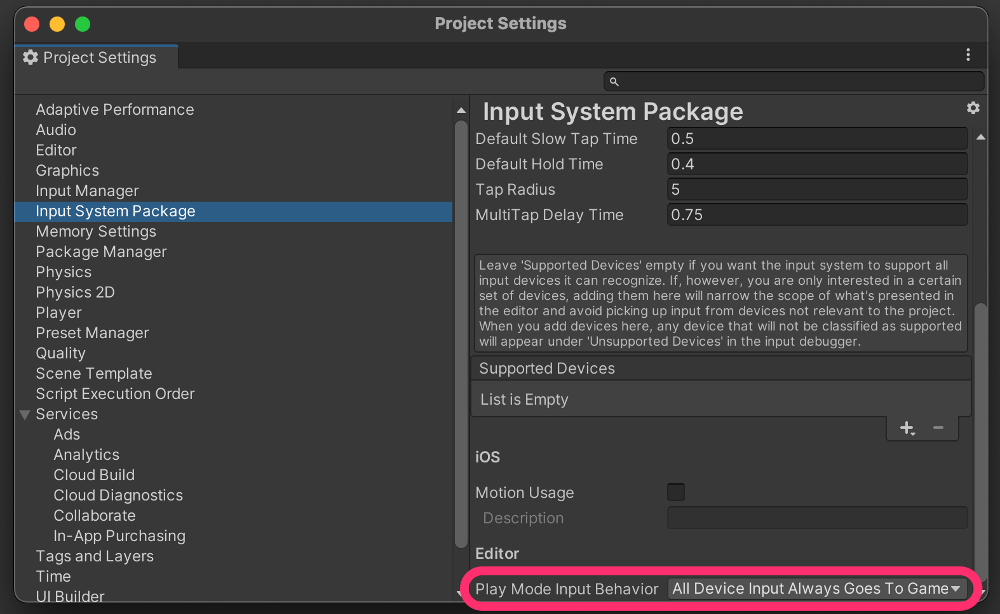
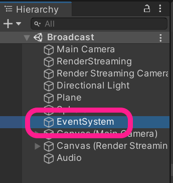
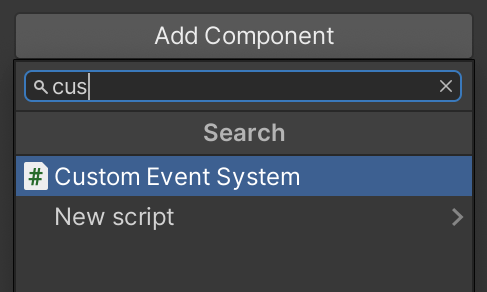

# Using with Input System

Unity Render Streaming supports controlling device input using [Input System](https://docs.unity3d.com/Packages/com.unity.inputsystem@latest). Input from a browser or Unity can be reflected to Unity on another PC.

The user input on the browser is converted to the message format of Input System and sent messages to another peers. The receiver of input message supports both Unity and the browser without having to implement any additional functionality.

## Preferences

You need to configure settings described below to use Input System. Note that different versions of Unity Editor support different methods.

### For Unity 2021.2

1. Open **Package Manager** window and check Input System version **1.3** installed.

2. Open **Project Settings** window, and **Player > Resolution and Presentatoin**, and enable **Run In Background**.

3. Move **Input System Package** in **Project Settings** window, and set `Ignore Focus` for **Background Behavior**.

4. In the **Input System Package**, set the **Play Mode Input Behavior** to `All Device Input Always Goes To Game View`.

### For Unity 2020.3 and 2019.4

1. Check Input System version **1.3** installed.
2. Open **Project Settings** window, and **Player > Resolution and Presentatoin**, and enable **Run In Background**.

3. Open scene and move **Hirarchy** window, and select `EventSystem` object, 

4. Move **Inspector** window, and replace the `EventSystem` component with a `CustomEventSystem` component. `CustomEventSystem` is contained in the package sample. For import instruction, refer to [this page](samples.md).

