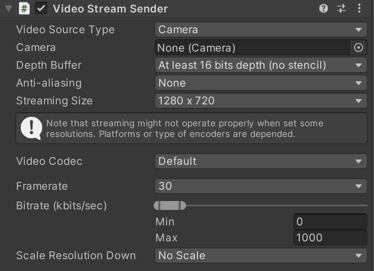

# Video Streaming Component

The component for sending video is [`Video Stream Sender`](../api/Unity.RenderStreaming.VideoStreamSender.html), and the component for receiving video is [`Video Stream Receiver`](../api/Unity.RenderStreaming.VideoStreamReceiver.html). Components are provided for the sender and receiver sides.

You can set a specific object for the video source to play on, including:

- A [Camera](https://docs.unity3d.com/Manual/class-Camera.html) plane
- A [Screen](https://docs.unity3d.com/Manual/com.unity.modules.screencapture.html) plane
- A Web Camera
- Any [Texture](https://docs.unity3d.com/Manual/class-TextureImporter.html) field in a component

## [`VideoStreamSender`](../api/Unity.RenderStreaming.VideoStreamSender.html) component reference

### Properties

| Property | Function | Default |
| --------- | ----------- | ------- |
| **Video Source Type** | Choose the type of source for your video streaming.   - *Camera*   - *Screen*   - *WebCam*   - *Texture* | Camera |
| *Camera* | Use this field to define the Camera assigned to the Video Stream Sender component.  |  |
| *Texture* | Use this field to define the Texture assigned to the Video Stream Sender component. |  |
| *Web Cam Device Index* | The index of the video input device to be used. See [WebCamTexture.devices](https://docs.unity3d.com/ScriptReference/WebCamTexture-devices.html). | 0 |
| *Auto Request User Authorization* | Whether request permission to use any video input sources. You don't need to enable it if you call [Application.RequestUserAuthorization](https://docs.unity3d.com/ScriptReference/Application.RequestUserAuthorization.html) yourself. | Enabled |
| *Depth Buffer* | The precision of the render texture's depth buffer in bits | No depth buffer |
| *Anti-aliasing* | The anti-aliasing level for the RenderTexture | None |
| *Streaming Size* | Size of the frame buffer used for streaming | 1280 x 720 |
| **Video Codec** | Options displays difference on each environments because some environments can use hardware codecs. Software codecs implementations works on all environments. *Default* option means trying to use all available codecs for negotiating other peers. | Default |
| **Frame rate** | The frame rate of the encoding process. Shouldn't set value over the game frame rate. | 30 |
| **Bitrate (kbits/sec)** | The bitrate of the video streaming. | |
| *Min* | The minimum value of the bitrate. | 0 |
| *Max* | The maximum value of the bitrate. | 1000 |
| **Scale Resolution Down** | The factor of multiply with the video resolution to reduce the bandwidth. | No Scale |

## [`VideoStreamReceiver`](../api/Unity.RenderStreaming.VideoStreamReceiver.html) component reference

### Properties

| Parameter | Description | Default |
| --------- | ----------- | ------- |
| **Render Mode** | Size of the frame buffer used for streaming.   - *Render Texture*   - *API Only* | *Render Texture* |
| *Target Texture* | Use this field to define the Render Texture assigned to the Video Stream Sender component.  |  |
| **Video Codec** | Options displays difference on each environments because some environments can use hardware codecs. Software codecs implementations works on all environments. *Default* option means trying to use all available codecs for negotiating other peers. | Default |

## Details

The network status affects the quality of video streaming. You can keep the streaming by changing several properties of components even if the network status makes worse. Note that you can't change *texture size*, *texture format*, and *video codec* after starting video streaming.

### Video Codec

The choice of video codec affects streaming performance. You can choose video codecs which implemented with hardware and software, when the texture size is large in particular, hardware implementation is faster. However, available hardware implementation codecs vary by platform, you may not be available in certain environments.

You need to choose codecs available for both sender and receiver. If you choose *Default* as a video codec, this package uses all available codecs implemented on the platform, so making problems due to codec mismatches less.

> [!NOTE]
> Some codecs may have limitations on the size of the resolution. For example, if you use an odd number for the size value, the incoming video may be automatically resized.

> [!NOTE]
> We've confirmed that *Firefox 104.0.2* doesn't complete the negotiation when trying to receive video when set *Default* for the video codec option to the sender. You need to set following codecs explicitly to the video sender.
> - *VP8*
> - *VP9 (Profile0, Profile2)*
> - *H264 Constrained Baseline 5.1*

### Frame rate

Sets the frame rate of the streaming video. You should set the *frame rate* below the game's *frame rate*.

### Down-scaling resolution

The larger the *texture resolution*, the higher the bit rate required for streaming. By reducing *texture resolution*, you can stabilize with less bandwidth.

### Bit rate

Controls the bandwidth used by specifying a *bit rate* limit for streaming.
