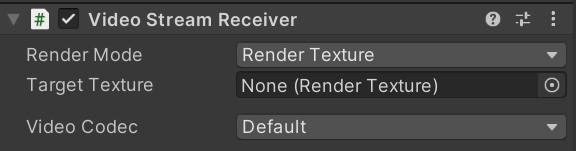

# Video Streaming

The base class for sending video is [`VideoStreamSender`](../api/Unity.RenderStreaming.VideoStreamSender.html), and the base class for receiving video is [`VideoStreamReceiver`](../api/Unity.RenderStreaming.VideoStreamReceiver.html). And various components are implemented using the inheritance relation. Components are provided for the sender and receiver sides.

> [!NOTE]
> The choice of video codec is currently limited. Use **H.264** if using a hardware encoder, or **VP8** if using a software encoder.

## [`VideoStreamSender`](../api/Unity.RenderStreaming.VideoStreamSender.html) component

This component sends the texture.

### Properties

| Parameter | Description | Default |
| --------- | ----------- | ------- |
| **Streaming Size** | Size of the frame buffer used for streaming | 1280, 720 |
| **Anti-aliasing** | The antialiasing level for the RenderTexture | None |
| **Depth Buffer** | The precision of the render texture's depth buffer in bits | No depth buffer |

## [`ScreenStreamSender`](../api/Unity.RenderStreaming.ScreenStreamSender.html) component

This component sends the image of the main display.

### Properties

| Parameter | Description | Default |
| --------- | ----------- | ------- |
| **Streaming Size** | Size of the frame buffer used for streaming | 1280, 720 |
| **Anti-aliasing** | The antialiasing level for the RenderTexture | None |
| **Depth Buffer** | The precision of the render texture's depth buffer in bits | No depth buffer |

## [`CameraStreamSender`](../api/Unity.RenderStreaming.CameraStreamSender.html) component

This component streams the `Camera` component's camera rendering results.  Uses `Target Texture` to store the rendering results.

> [!NOTE]
> You can attach the `Target Texture` to the `Camera` component.
> If `Target Texture` is attached on Camera, use that `Render Texture` setting first.

### Properties

| Parameter | Description | Default |
| --------- | ----------- | ------- |
| **Streaming Size** | Size of the frame buffer used for streaming | 1280, 720 |
| **Anti-aliasing** | The antialiasing level for the RenderTexture | None |
| **Depth Buffer** | The precision of the render texture's depth buffer in bits | No depth buffer |

## [`WebCamStreamSender`](../api/Unity.RenderStreaming.WebCamStreamSender.html) component

This component streams the [WebCamTexture](https://docs.unity3d.com/ScriptReference/WebCamTexture.html) rendering results.

> [!NOTE]
> When building application for iOS platform, you need set `Camera Usage Description` on Player Settings.
> If not set this, your application exits. (refer [this page](https://developer.apple.com/library/archive/documentation/General/Reference/InfoPlistKeyReference/Articles/CocoaKeys.html#//apple_ref/doc/uid/TP40009251-SW24))

### Properties

| Parameter | Description | Default |
| --------- | ----------- | ------- |
| **Streaming Size** | Size of the frame buffer used for streaming | 1280, 720 |
| **Device Index** | Index of [`WebCamTexutre.devices`](https://docs.unity3d.com/ScriptReference/WebCamTexture-devices.html) to use | 0 |

## [`VideoStreamReceiver`](../api/Unity.RenderStreaming.VideoStreamReceiver.html) component

This component receives a videostream and exposes a texture that rendered the receiving frame buffer. 

### Properties

| Parameter | Description | Default |
| --------- | ----------- | ------- |
| **Streaming Size** | Size of the frame buffer used for streaming | 1280, 720 |
| **Connection Id** | ID of receiving videostream | Empty |
