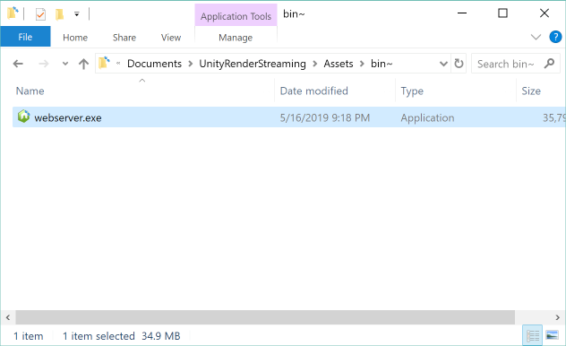

# The Web Application

The **Web application** 

- handles signaling between Unity and the Web browser
- is the location of the Web page 

## The Web Client

The **Render Streaming** web application uses WebRTC technologies, which means that your browser must also support WebRTC. See [this page](https://caniuse.com/#search=webrtc) for details on which browsers support WebRTC.

The following browsers are compatible:

| Browser                           | Windows            | Mac                | iOS                | Android            |
| --------------------------------- | ------------------ | ------------------ | ------------------ | ------------------ |
| Google Chrome                     | :white_check_mark: | :white_check_mark: |                    | :white_check_mark: |
| Safari                            |                    | :white_check_mark: | :white_check_mark: |                    |
| Firefox                           | :white_check_mark: |                    |                    |                    |
| Microsoft edge (Chromium based)   | :white_check_mark: |                    |                    |                    |

> [!NOTE]
> In **Safari** and **iOS Safari**, WebRTC features cannot be used with **http**. Instead, **https** must be used.

## The Web Server

Click on `Edit/Render Streaming/Download web app` menu item to download [our web server](https://github.com/Unity-Technologies/UnityRenderStreaming/releases).
After downloading, run it from the command line.



### Command Options

| Option                | Details                                            | Default     |
| --------------------- | -------------------------------------------------- | ----------- |
| -h --help             | Show the help menu                                 |             |
| -p —port \<number\>   | Set the port number                                | 80          |
| -s --secure           | Use https                                          |             |
| -k —keyfile \<path\>  | Designate the private key file to use with https   | server.key  |
| -c —certfile \<path\> | Designate the certification file to use with https | server.cert |
| -w --websocket        | Use Websocket as signaling protocol                |             |

### Command Examples

Use the following command to start the server as http. Port 80 will be used.

```shell
.\webserver
```

This command will run the server as https. Port 443 will be used. A certificate (`server.cert`) and a key (`server.key`) must also be set up ([details](https.md)).

```shell
.\webserver -s -p 443
```

The command will run in the mode that uses WebSocket as the signaling protocol.

```shell
.\webserver -w
```

When running a https server, keep in mind to set the `URL signaling` property of the Renderstreaming component in Unity to https as well.
Use this command to display the help guide. 

```shell
.\webserver -h
```

## How to custmize web application

Please see the page [Customize Web Application](customize_webapp.md).