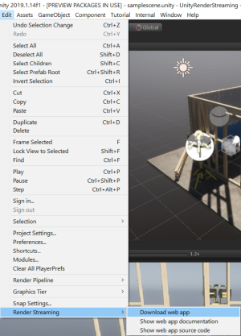

# Web Application

The **Web application** 

- handles signaling between Unity and the Web browser
- is the location of the Web page 

## The Web Client

The **Render Streaming** web application uses WebRTC technologies, which means that your browser must also support WebRTC. You can see a table of supported browsers [here](index.md#web-browsers-support).

> [!NOTE]
> See [this page](https://caniuse.com/#search=webrtc) for details on which browsers support WebRTC.


## The Web Server

Click on **Edit > Render Streaming > Download web app** menu item to download our web server on [this site](https://github.com/Unity-Technologies/UnityRenderStreaming/releases).



After downloading, run it from the command line.


### Command Options

| Option                    | Details                                            | Default       |
| ------------------------- | -------------------------------------------------- | ------------- |
| `-h` `--help`             | Show the help menu                                 |               |
| `-p` `—port \<number\>`   | Set the port number                                | `80`          |
| `-s` `--secure`           | Use https                                          |               |
| `-k` `—keyfile \<path\>`  | Designate the private key file to use with https   | `server.key`  |
| `-c` `—certfile \<path\>` | Designate the certification file to use with https | `server.cert` |
| `-w` `--websocket`        | Use Websocket as signaling protocol                |               |
| `-m` `—-mode \<type\>`    | Choose Communication mode public or private        | `public`      |
| `-l` `—logging \<type\>`  | Choose http logging type (use [morgan](https://www.npmjs.com/package/morgan) library)      | `dev`         |

### Command Examples

Use the following command to start the server as http. Port `80` will be used.

```shell
.\webserver
```

This command will run the server as https. Port 443 will be used. A certificate (`server.cert`) and a key (`server.key`) must also be set up ([details](https.md)).

```shell
.\webserver -s -p 443
```

The command will run in the mode that uses WebSocket as the signaling protocol.

```shell
.\webserver -w
```

The command will run in private mode. 

```shell
.\webserver -m private
```
> [!NOTE]
> In private mode, Signaling only using same `ConnectionId` between peers.


When running a https server, keep in mind to set the `URL signaling` property of the Renderstreaming component in Unity to https as well.
Use this command to display the help guide. 

```shell
.\webserver -h
```

## How to custmize web application

Please see the page [Customize Web Application](customize-webapp.md).