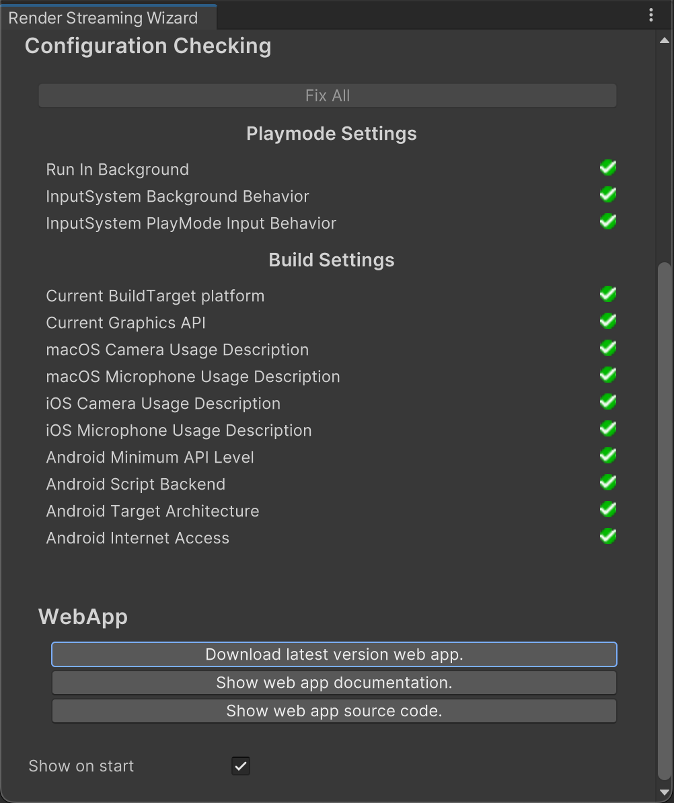

# Unity Render Streaming Wizard

Unity Render Streaming includes the **Render Streaming Wizard** to help you configure your Unity Project so that it's compatible with Unity Render Streaming.

To open **Render Streaming Wizard**, go to **Window > Render Streaming** and select **Render Streaming Wizard**.

## Unity Render Streaming Version

At the top of the window, you can see the version of the Unity Render Streaming package installed in your Unity Project. The **Check Update** button provides a shortcut to the Package Manager window.

## Configuration Checking

Your Unity Project must adhere to all the configuration tests in this section for Unty Render Streaming to work correctly. If a test fails, a message explains the issue and you can click a button to fix it. This helps you quickly fix any major issues with your Unity Project.

### Playmode Settings

| Configuration Option | Description |
| --- | ---- |
| **Run In Background** | Check to make sure **Run In Background** is enabled in the Player Settings. This value is needed to continue processing user input even when losting the focus from the Unity application. (menu: **Edit > Project Settings > Player**)   Press the **Fix** button to enable **Run In Background**. |
| **InputSystem Background Behavior** | Check to make sure **Background Bahavior** is set to a **Ignore Focus** in Input System. This value is needed to continue processing user input even when losting the focus from the Unity application. (menu: **Edit > Project Settings > Input System**)   Press the **Fix** button to set **Background  Bahavior** to **Ignore Focus**. |
| **InputSystem PlayMode Input Behavior** | Check to make sure **PlayMode Input Bahavior** is set to a **All Device Input Always Goes To Game View** in Input System. This value is needed to continue processing user input even when losting the focus from the Unity Editor. (menu: **Edit > Project Settings > Input System**)   Press the **Fix** button to set **PlayMode Input Bahavior** to **All Device Input Always Goes To Game View**. |

### Build Settings

| Configuration Option | Description |
| --- | ---- |
| **Current Build Target Platform** | Checks the platform of the **Build Target** is supported by Unity Render Streaming.   Press the **Fix** button to change the **Build Target** to the supported platform. |
| **Current Graphics API** | Checks the **Graphics API** is supported by Unity Render Streaming.   Press the **Fix** button to change the **Graphics API** to the supported graphics APIs. |
| **macOS Camera Usage Description** | Check **Camera Usage Description** for macOS platform in the Player Settings. This value is needed to use Web Camera as a video source in the [Video Stream Sender component](video-streaming.md).   Press the **Fix** button to set **Camera Usage Description** to `For using WebCam`. |
| **macOS Microphone Usage Description** | Check **Microphone Usage Description** for macOS platform in the Player Settings. This value is needed to use Microphone as a audio source in the [Audio Stream Sender component](audio-streaming.md).   Press the **Fix** button to set **Microphone Usage Description** to `For using Microphone`. |
| **iOS Camera Usage Description** | Check **Camera Usage Description** for iOS platform in the Player Settings. This value is needed to use Web Camera as a video source in the [Video Stream Sender component](video-streaming.md).   Press the **Fix** button to set **Camera Usage Description** to `For using WebCam`. |
| **iOS Microphone Usage Description** | Check **Microphone Usage Description** for iOS platform in the Player Settings. This value is needed to use Microphone as a audio source in the [Audio Stream Sender component](audio-streaming.md).   Press the **Fix** button to set **Microphone Usage Description** to `For using Microphone`. |
| **Android Minimum API Level** | Check **Minimum API Level** for Android platform in Player Settings.   Press the **Fix** button to set **Minimum API Level** to **Level24**. |
| **Android Script Backend** | Check **Scripting Backend**  for Android platform in Player Settings. Unity Render Streaming only supports **IL2CPP** for Android platform.   Press the **Fix** button to set **Scripting Backend** to **IL2CPP**.
| **Android Target Architecture** | Check **Target Architecture** for Android platform in Player Settings. Unity Render Streaming only supports **ARM64** for Android platform.   Press the **Fix** button to set **Target Architecture** to **ARM64**. |
| **Android Internet Access** | Check **Internet Access** for Android platform in Player Settings. Unity Render Streaming only supports **Required** for Android platform.   Press the **Fix** button to set **Internet Access** to **Required**. |

## WebApp

- **Download latest version web app**: Download web application to the specified folder.
- **Show web app documentation**: Open the web page places documentation for web application.
- **Show web app source code**: Open the web page places source code for web application.
