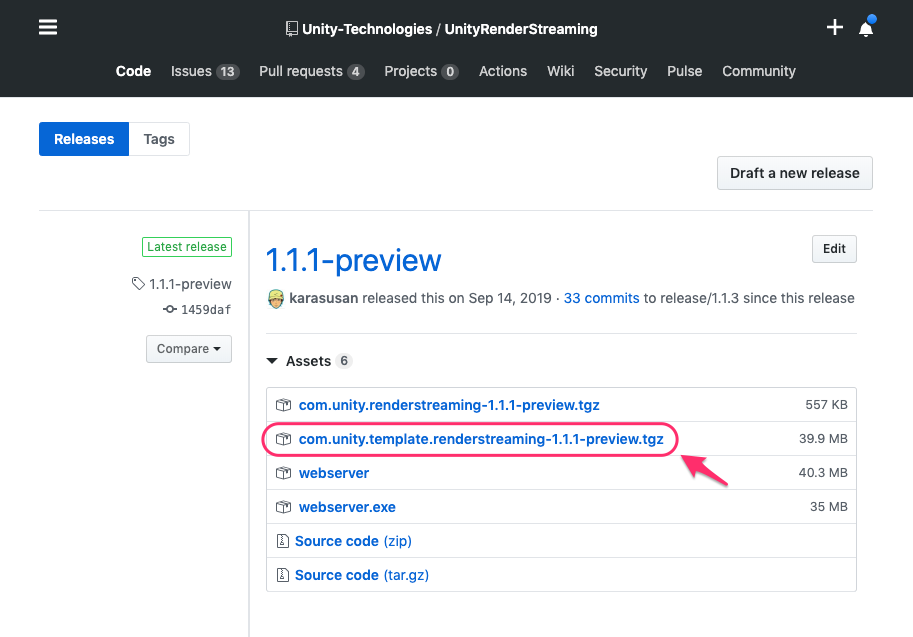
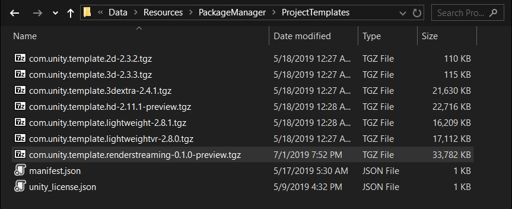
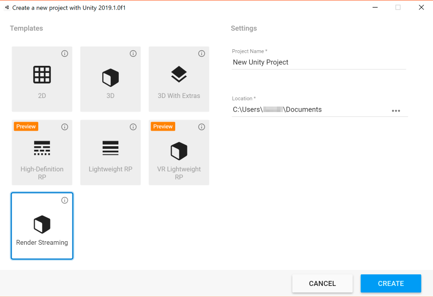
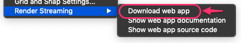
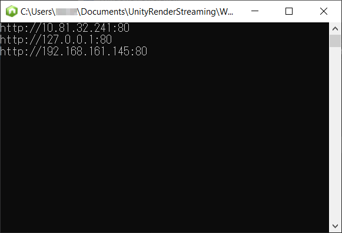
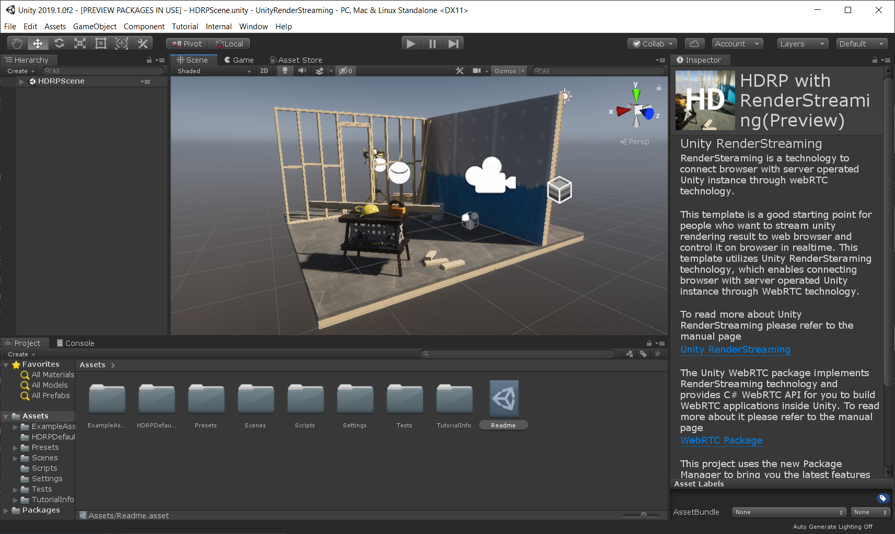
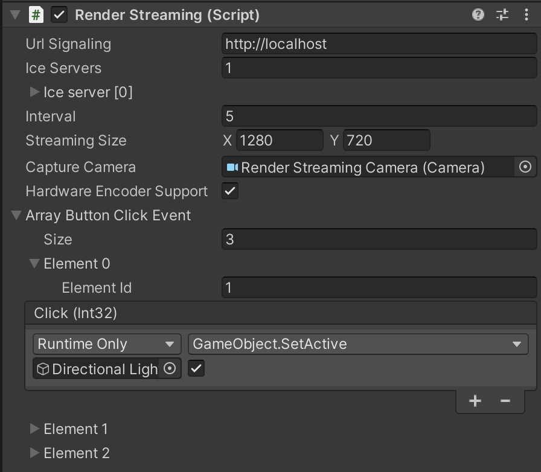

# チュートリアル

Unity Render Streaming テンプレートパッケージの利用を開始する方法について説明します。

### パッケージのダウンロード

テンプレートパッケージを [Github Release](https://github.com/Unity-Technologies/UnityRenderStreaming/releases) からダウンロードします。以下のパッケージをダウンロードしてください。

- `com.unity.template.renderstreaming-x.x.x-preview.tgz`



> [!NOTE]
> これらの作業は暫定的なものです。将来的にはこれらのパッケージは PackageManager に登録される予定です。PackageManager から直接ダウンロード可能になれば、手動でのパッケージインストールは不要になります。

### パッケージの配置

ダウンロードしたパッケージを所定のフォルダーに移動することで、**プロジェクトテンプレート**として利用することが可能です。
プロジェクトテンプレートとは、Unity で新規プロジェクトを作成するときに設定済みの Unity プロジェクトを選択できる機能です。

テンプレートパッケージを利用する際は、tgz ファイルをそれぞれ以下のフォルダーに配置します。

`com.unity.template.renderstreaming-x.x.x-preview.tgz` を以下のフォルダーに移動

```
  <Unity Editor Root>/Data/Resources/PackageManager/ProjectTemplates
```



パッケージを移動後、Unity Hub を起動し新規プロジェクトを作成します。テンプレートに `Render Streaming` が追加されていることを確認してください。



### Web アプリケーションの起動

Web アプリケーションは メニューから **Edit / Render Streaming / Download web app** を選択してください。



このファイルを実行するとコマンドプロンプトが表示されます。下記のログがコマンドプロンプトに表示されます。Web アプリケーションのアドレスもここに表示されています。コマンドオプションは [パッケージのドキュメント](https://docs.unity3d.com/Packages/com.unity.renderstreaming@2.2/manual/webapp.html) を確認してください。



Web アプリケーションのソースコードは [WebApp](WebApp) に配置しています。このソースコードを改変することで、ウェブページを自由にカスタマイズすることができます。

### Unity 側の設定

サンプルシーン `Assets/Scenes/samplescene.unity` を開きます。



ヒエラルキービューの `RenderStreaming` を選択し、インスペクタビューの `Render Streaming` コンポーネントを確認してください。



`URL Signaling` パラメーターには、先ほど起動した Web サーバーのアドレスを指定してください。インスペクターの各設定については Render Streaming クラスの[リファレンス](class-renderstreaming.md)を参照してください。

### Web ページへのアクセス

[対応ブラウザー](index.md)のリストに含まれているブラウザーを起動します。
Web サーバーのアドレスにアクセスしてください。以下のように Web ページが表示されます。


上の画像のような結果にならなかった場合は、ブラウザーのバージョンが古い可能性があります。最新バージョンのブラウザーをインストールしてください。